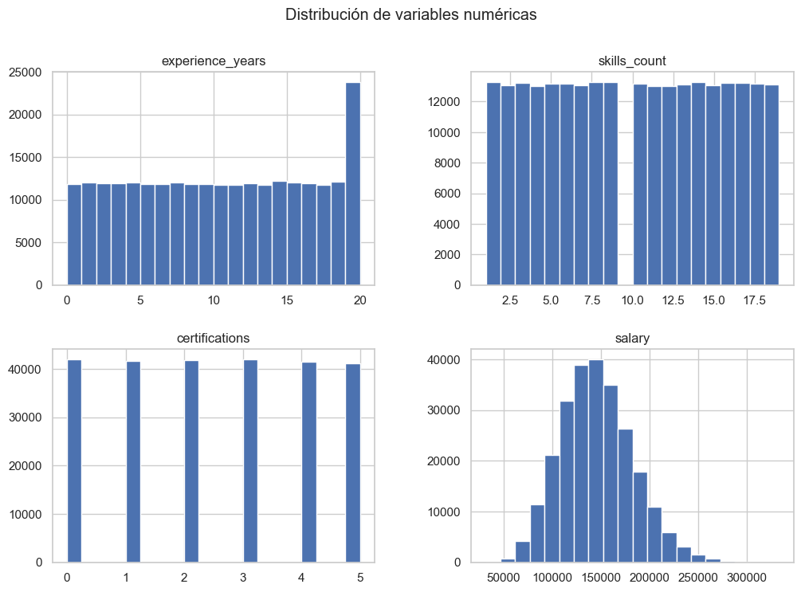
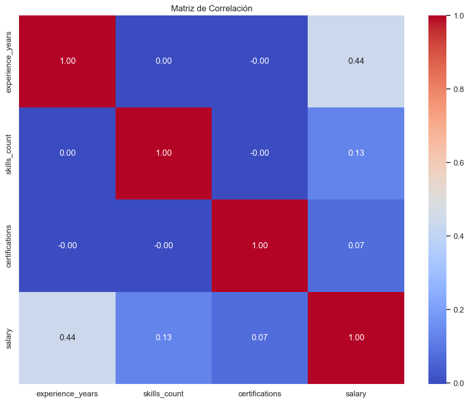
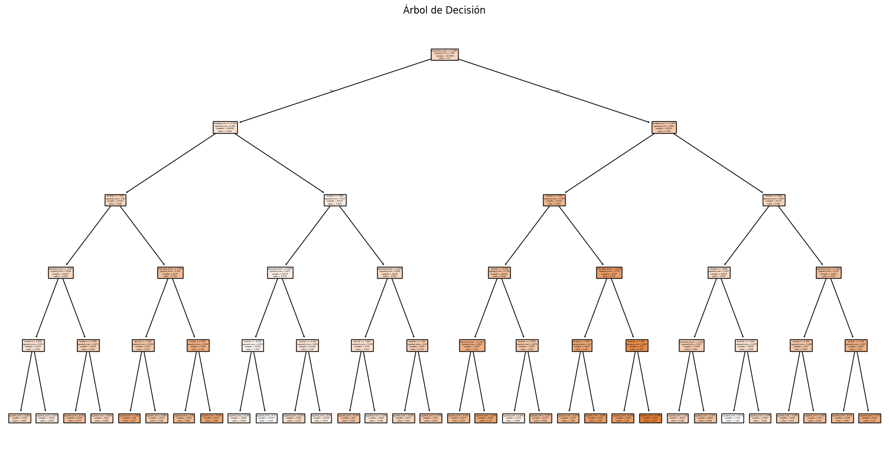
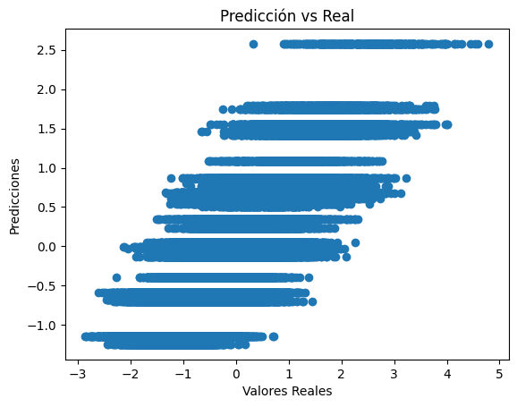

# 📊 Predicción de Salarios con Minería de Datos (KDD)

## 📌 Descripción del Proyecto

Este proyecto implementa el proceso de Descubrimiento de Conocimiento en Bases de Datos (KDD) para analizar y predecir salarios en función de características laborales como experiencia, educación, industria y habilidades.

El enfoque combina análisis exploratorio, transformación de datos y modelado mediante técnicas de machine learning, específicamente un Árbol de Decisión para regresión.

## Objetivo

Desarrollar un modelo capaz de predecir el salario de un individuo a partir de variables relevantes del mercado laboral, identificando patrones ocultos en los datos.

## Dataset: Dataset de Salario Laboral

- Nombre: Job Salary Prediction Dataset
- Fuente: Kaggle
- Link: [Click Aquí](https://www.kaggle.com/datasets/nalisha/job-salary-prediction-dataset)
- Tipo: Datos estructurados (numéricos y categóricos)
- Descripción: Dataset de gran escala que contiene información sobre:
- Experiencia laboral
    - Nivel educativo
    - Industria
    - Habilidades
    - Tipo de empresa
    - Ubicación
    - Salario (variable objetivo)

## ❓ Problema a Resolver

Predecir una variable continua (salario), lo que clasifica este proyecto como un problema de: ➡️ Regresión supervisada

## 🧠 Proceso KDD Aplicado

### 1. Selección de Datos

Se utilizó un dataset limpio con múltiples variables relevantes del entorno laboral.

### 2. Limpieza de Datos

- Eliminación de duplicados
- Verificación de valores nulos
- Validación de tipos de datos

### 3. Transformación de Datos

Codificación de variables categóricas (Label Encoding) & Escalado de variables numéricas (StandardScaler)

``` 
from sklearn.preprocessing import 
LabelEncoder le = LabelEncoder() df[col] = le.fit_transform(df[col]) 
```

### 4. Análisis Exploratorio (EDA)

| Distribución de Variables Numéricas  |  Correlación |
:-------------------------:|:-------------------------:
  |  

### 5. Preparación de Datos y Modelado

División:

- 80% entrenamiento
- 20% prueba

> Se utilizó un modelo de: ➡️ Árbol de Decisión para Regresión

``` 
from sklearn.tree import DecisionTreeRegressor

model = DecisionTreeRegressor(max_depth=5, random_state=42)
model.fit(X_train, y_train)
``` 

## 🌳 Visualización del Modelo: Árbol de Decisión



## 📈 Resultados del Modelo

Predicción vs Valores Reales:



## 📏 Métricas de Evaluación

- MAE (Error Absoluto Medio): 0.5033154495583846
- MSE (Error Cuadrático Medio): 0.39419070228999686
- R² (Coeficiente de determinación): 0.603118981102588

## 🔍 Hallazgos del Modelo

Los resultados del modelo muestran que el salario está principalmente influenciado por variables relacionadas con la trayectoria profesional y el contexto laboral. En general, el árbol de decisión logró capturar patrones coherentes, reflejando tendencias reales del mercado y permitiendo interpretar cómo diferentes factores impactan la predicción.

Entre los hallazgos más relevantes se destacan:

- Mayor experiencia laboral → incremento directo del salario
- Más certificaciones y educación → mejores ingresos
- Diferencias salariales según industria
- Buen ajuste general del modelo, con ligeras desviaciones en casos extremos

## 👥 Autores

- Emil Pérez Barranco
- Wilver Abreu